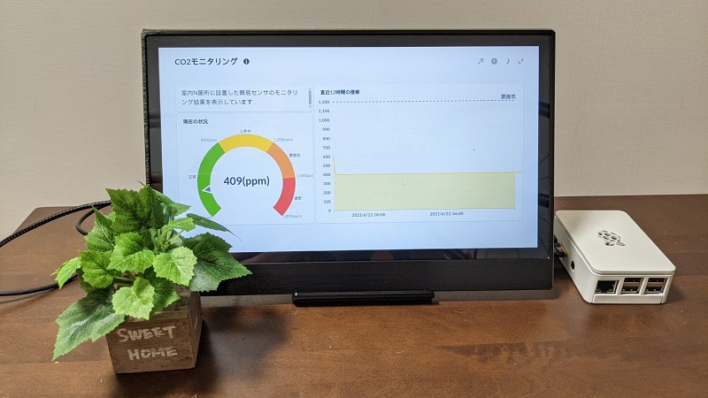
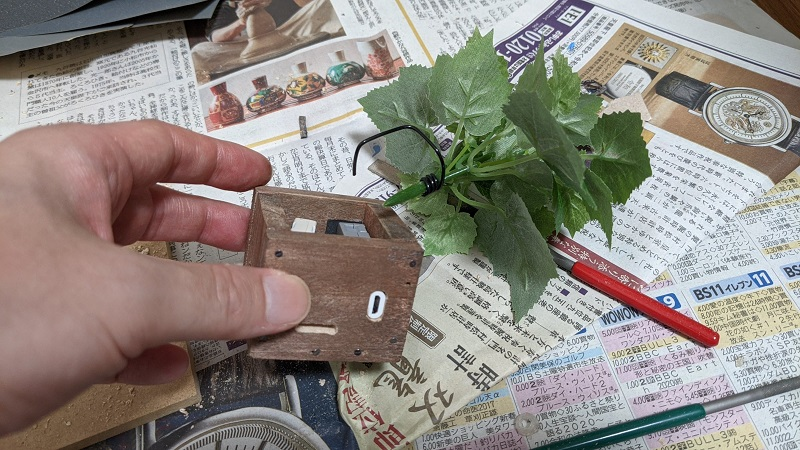

# Self-made CO2 sensor kit



* A CO2 sensor is embedded in the base of artificial plants.

## Architecture


## Parts

| Parts | Price(JPY) | Link |
| ---- | ---- | ---- |
| Raspberry Pi 3B+  |  5,775  | https://www.switch-science.com/catalog/3850/ |
| M5 ATOM Lite| 1,287 | https://www.switch-science.com/catalog/6262/ |
| TVOC/eCO2 sensor unit | 1,562 | https://www.switch-science.com/catalog/6619/ |

## Codes

### SQL table setting

| created_at(ISO8601) | id(string) | type(string) | value(float) |
| ---- | ---- | ---- | ---- |
| 2014-10-10T13:50:40 | living_room	| CO2 | 400.5 | 
| 2014-10-10T13:50:50 | dining	| TEMP | 20.0 |
| ... | | | |

- IDは設置位置を表すものとした．
- 1エッジが複数センサを持つ場合もある想定．
- 投入側は `created_at` 不要とし，自動採番とした．

```bash
# SQLite table create
>> create table sensors_value(created_at TIMESTAMP DEFAULT (DATETIME('now', 'localtime')), id text, type text, value float);
```

### Node-RED flow

[./node-red_flow.json](./node-red_flow.json)

### M5 Lite code

[./m5_flow.png](./m5_flow.png)

---

## MISC

### Comments

時系列データであることを考えれば，InfluxDB + Grafana という構成のがよかったかもしれません．

### Embedded CO2 sensor



